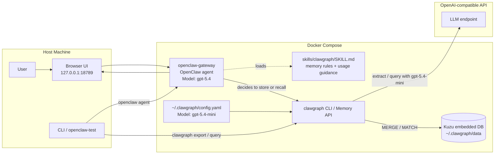

# DevContainer Test Bed

This directory provides a containerized environment for testing ClawGraph with AI agents (OpenClaw).

## Architecture



In this setup, OpenClaw handles the conversation loop and decides whether memory is useful. When it chooses to persist or recall something, it calls ClawGraph, which uses its own smaller extraction/query model and stores data in local Kuzu files.

## Prerequisites

- Docker + Docker Compose v2
- `OPENAI_API_KEY` (or `ANTHROPIC_API_KEY`) env var set

## Quick Start

### 1. Unit Tests (no API key needed)

```bash
docker compose -f .devcontainer/docker-compose.test.yml run test-bed
```

### 2. ClawGraph CLI Integration Tests (requires API key)

```bash
export OPENAI_API_KEY=sk-...
docker compose -f .devcontainer/docker-compose.test.yml run integration-test
```

### 3. Full OpenClaw Agent Test (the interesting one)

Start the OpenClaw gateway with the ClawGraph skill loaded:

```bash
export OPENAI_API_KEY=sk-...
docker compose -f .devcontainer/docker-compose.test.yml up openclaw-gateway
```

The gateway prints the Control UI URL with a token included. By default this is:

```text
http://127.0.0.1:18789/?token=lobstergym-dev-token
```

Open that URL in your browser to access the **WebChat UI** and ask the agent to
work normally.

For a realistic memory test, use normal conversational phrasing instead of telling
the agent which skill to call. Example:

```text
Hi, I'm Alice. I work at Google, I'm learning Rust, and I'm planning an agent-memory demo for later this week.
```

Then ask:

```text
What do you know about me so far?
```

Natural agent-decided storage is still experimental. In repeated fresh-stack
tests, OpenClaw sometimes routes these facts into its own workspace memory flow
instead of reliably invoking ClawGraph.

For deterministic validation, use an explicit ClawGraph instruction.

In a **second terminal**, run the automated test:

```bash
docker compose -f .devcontainer/docker-compose.test.yml run openclaw-test
```

This sends messages to the agent via CLI, then inspects ClawGraph directly.

## How to Communicate with the Agent

### Option A: WebChat UI (interactive, easiest)

1. Start the gateway: `docker compose ... up openclaw-gateway`
2. Open `http://127.0.0.1:18789/?token=lobstergym-dev-token` in your browser
3. Chat naturally: "Hi, I'm Alice. I work at Google, I'm learning Rust, and I'm planning an agent-memory demo for later this week."
4. Then: "What do you know about me so far?"

### Option B: CLI one-shot (scriptable, for CI)

```bash
# Send a single message and get the agent's response on stdout
docker compose -f .devcontainer/docker-compose.test.yml run openclaw-test \
  bash -c 'openclaw agent --to +15555550123 --thinking minimal --message "Use your ClawGraph memory skill to store exactly these facts: Alice works at Google. Alice is learning Rust. Alice is planning an agent-memory demo for later this week."'
```

`--to` is required so OpenClaw has a session key for the conversation.
For the current `openai/gpt-5.4` OpenClaw model path, pass `--thinking minimal`
so agent turns are accepted consistently. ClawGraph itself uses `gpt-5.4-mini`
inside the same container.

The bundled `openclaw-test` service uses this explicit control path on purpose so
the automated validation stays deterministic. It verifies persistence through
direct `clawgraph export` output rather than a second agent-mediated query.

### Option C: Inspect ClawGraph directly (verification)

After the agent has stored facts, check the graph:

```bash
# From the gateway container
docker compose -f .devcontainer/docker-compose.test.yml exec openclaw-gateway \
  clawgraph export --output json

# Or query
docker compose -f .devcontainer/docker-compose.test.yml exec openclaw-gateway \
  clawgraph query "Who works where?" --output json
```

## VS Code Dev Container

1. Open this repo in VS Code
2. Install the "Dev Containers" extension
3. Press `Ctrl+Shift+P` → "Dev Containers: Reopen in Container"
4. The container installs Python 3.11, Node.js 22, ClawGraph, and OpenClaw
5. Port 18789 is forwarded automatically
6. Run `openclaw onboard` inside the container to set up the agent

## OpenClaw Skill Location

The ClawGraph skill is at `skills/clawgraph/SKILL.md`. The docker-compose
copies it to `~/.openclaw/workspace/skills/clawgraph/SKILL.md` inside the
container so OpenClaw auto-discovers it.

## CI Integration

Unit tests (no secrets needed):

```yaml
- name: Container unit tests
  run: |
    docker compose -f .devcontainer/docker-compose.test.yml run test-bed
```

Integration tests with real LLM calls (use GitHub Secrets):

```yaml
- name: Integration tests
  env:
    OPENAI_API_KEY: ${{ secrets.OPENAI_API_KEY }}
  run: |
    docker compose -f .devcontainer/docker-compose.test.yml run integration-test
```

## Troubleshooting

| Issue | Fix |
|-------|-----|
| "pairing required" | Run `openclaw devices list` then `openclaw devices approve <id>` |
| Gateway won't start | Check `OPENAI_API_KEY` is set; run `openclaw doctor` |
| Port 18789 in use | Stop other OpenClaw instances or change port in compose |
| Node version error | Ensure image has Node ≥22 (check `node --version`) |
