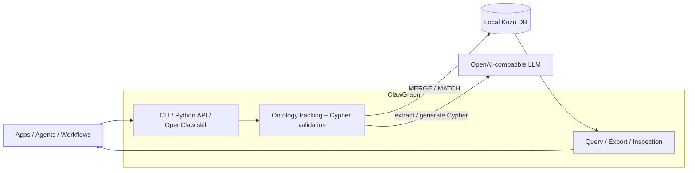

# ClawGraph

> Local-first, embedded graph memory for AI agents.

[](LICENSE)
[](https://python.org)
[](https://github.com/clawgraph/clawgraph/actions/workflows/test.yml)
[](https://pypi.org/project/clawgraph/)

**Official site**: [clawgraph.ai](https://clawgraph.ai)

## What It Does

ClawGraph turns natural language into persistent graph memory. Tell it facts, it stores them in a local embedded graph database ([Kuzu](https://kuzudb.com/)). Ask it questions, it queries the graph and returns results.

The project is currently focused on one clear lane: a small, inspectable, Python-first memory layer for agents that want structured recall without running separate infrastructure.

- **Natural language in, graph memory out** — no Cypher knowledge required
- **Local-first** — embedded Kuzu database, no server, no Docker, just a local file
- **Inspectable** — query the graph directly, export JSON, inspect ontology evolution
- **Automatic ontology** — the LLM infers and maintains your graph schema
- **Python API** — `from clawgraph import Memory` for use in agentic loops
- **Batch mode** — process multiple facts in a single LLM call
- **Idempotent** — adding the same fact twice won't create duplicates

## Current State

ClawGraph is early-stage, but the core system is working and under active hardening.

- Python package published on PyPI
- Embedded persistence with snapshots and restore
- JSON output across the CLI for agent use
- Property-based and regression-tested core write/query paths
- OpenAI-compatible LLM support today via the OpenAI SDK
- Kuzu as the current database backend

Planned direction:

- broader LLM provider support beyond OpenAI-compatible APIs
- additional database backends beyond Kuzu
- better recall/context assembly for agent workflows

## Installation

```bash
pip install clawgraph
```

## Quick Start

### CLI

```bash
# Store facts
clawgraph add "John works at Acme Corp as a software engineer"
clawgraph add "Alice is a data scientist at Google"
clawgraph add "John and Alice are friends"

# Query the graph
clawgraph query "Where does John work?"
# ┏━━━━━━━━┳━━━━━━━━━━┳━━━━━━━━━━━┓
# ┃ a.name ┃ r.type   ┃ b.name    ┃
# ┡━━━━━━━━╇━━━━━━━━━━╇━━━━━━━━━━━┩
# │ John   │ WORKS_AT │ Acme Corp │
# └────────┴──────────┴───────────┘

# Batch add (one LLM call for multiple facts)
clawgraph add-batch "Bob is a designer" "Bob works at Netflix"

# View the ontology
clawgraph ontology

# Export the graph as JSON
clawgraph export
clawgraph export graph.json

# JSON output for agents
clawgraph query "Who works at Acme?" --output json

# Configure
clawgraph config llm.model gpt-5.4-mini
clawgraph config                         # show all config
```

### Python API (for agentic loops)

```python
from clawgraph import Memory

mem = Memory()

# Add facts
mem.add("John works at Acme Corp")
mem.add("Alice is a data scientist at Google")

# Batch add — multiple facts, one LLM call
mem.add_batch([
    "Bob is a designer at Netflix",
    "Carol manages engineering at Acme",
    "Bob and Carol are married",
])

# Query
results = mem.query("Who works where?")
# [{"a.name": "John", "r.type": "WORKS_AT", "b.name": "Acme Corp"}, ...]

# Direct access
mem.entities()        # all entities
mem.relationships()   # all relationships
mem.export()          # full graph + ontology as dict
```

For agents, initialize `Memory()` once and reuse it — the DB connection and ontology are kept warm across calls.

## OpenClaw Walkthrough

If you want to verify the OpenClaw integration the way a first-time installer would, use the Dockerized devcontainer stack in this repo.

This walkthrough uses a deliberate model split:

- OpenClaw runs on `gpt-5.4`
- ClawGraph extraction uses `gpt-5.4-mini`

Prerequisites:

- Docker is running
- `OPENAI_API_KEY` is set in the repo `.env`

Start the OpenClaw gateway:

```bash
docker compose -p ocwalk -f .devcontainer/docker-compose.test.yml up -d openclaw-gateway
```

Then send a normal conversational message. The point of this test is to see whether the agent decides to use ClawGraph naturally, not because you explicitly told it which skill to call.

```bash
docker compose -p ocwalk -f .devcontainer/docker-compose.test.yml exec openclaw-gateway \
  openclaw agent --local --to +15555550123 --thinking minimal --timeout 120 \
  --message "Hi, I'm Alice. I work at Google, I'm learning Rust, and I'm planning an agent-memory demo for later this week."
```

Now ask the agent to recall what it knows:

```bash
docker compose -p ocwalk -f .devcontainer/docker-compose.test.yml exec openclaw-gateway \
  openclaw agent --local --to +15555550123 --thinking minimal --timeout 120 \
  --message "What do you know about me so far?"
```

Inspect ClawGraph directly to confirm what was persisted:

```bash
docker compose -p ocwalk -f .devcontainer/docker-compose.test.yml exec openclaw-gateway \
  clawgraph export --output json
```

If you want the browser UI as well, open `http://127.0.0.1:18789/?token=lobstergym-dev-token` after the gateway starts.

Natural OpenClaw auto-storage is still experimental. For a deterministic
OpenClaw validation path, use the explicit control flow documented in
`.devcontainer/README.md` and verify persistence with `clawgraph export`.

For a more detailed container-oriented walkthrough, see `.devcontainer/README.md`.

### Custom Ontology (constrained extraction)

By default ClawGraph lets the LLM choose entity labels and relationship types freely. For domain-specific applications, you can constrain extraction to a fixed schema:

```python
from clawgraph import Memory

# Only extract these entity types and relationships
mem = Memory(
    allowed_labels=["Person", "Company", "Skill"],
    allowed_relationship_types=["WORKS_AT", "HAS_SKILL", "MANAGES"],
)

mem.add("Alice is a Python developer at Acme Corp")
# Entities: Alice (Person), Python (Skill), Acme Corp (Company)
# Relationships: Alice -WORKS_AT-> Acme Corp, Alice -HAS_SKILL-> Python
```

You can also pass a fully configured `Ontology` object:

```python
from clawgraph.ontology import Ontology
from clawgraph import Memory

ont = Ontology(
    allowed_labels=["Patient", "Doctor", "Condition"],
    allowed_relationship_types=["TREATS", "DIAGNOSED_WITH", "REFERRED_BY"],
)
mem = Memory(ontology=ont)
```

Constraints are injected into the LLM prompt, so the model will only produce entities and relationships matching your schema.

## Architecture



ClawGraph sits between your application layer and local graph storage. Apps, agents, and automations call ClawGraph through the CLI, Python API, or an agent integration such as an OpenClaw skill. ClawGraph then uses an OpenAI-compatible LLM to extract or query structured facts, validates the generated Cypher, and persists the results in a local Kuzu database.

ClawGraph uses a **generic schema** — all entities are stored as `Entity(name, label)` nodes and all relationships use `Relates(type)` edges. This means the LLM doesn't need to generate table DDL, just extract structured data.

| Component | Library | Why |
|-----------|---------|-----|
| CLI | [Typer](https://typer.tiangolo.com/) | Type-hint driven, minimal boilerplate |
| LLM | [OpenAI SDK](https://github.com/openai/openai-python) | OpenAI-compatible APIs today, simple direct integration |
| Graph DB | [Kuzu](https://kuzudb.com/) | Embedded, no server, native Cypher |
| Output | [Rich](https://rich.readthedocs.io/) | Tables, panels, colors |

## Configuration

Config lives at `~/.clawgraph/config.yaml`:

```yaml
llm:
  model: gpt-5.4-mini
  temperature: 0.0
db:
  path: ~/.clawgraph/data
output:
  format: human
```

### API Key Setup

ClawGraph currently uses the OpenAI SDK and supports OpenAI-compatible endpoints. There are three ways to provide configuration (in priority order):

**1. Project `.env` file (recommended)**

Create a `.env` file in your working directory:

```bash
OPENAI_API_KEY=sk-proj-...
```

ClawGraph auto-loads `.env` from the current directory. This file takes precedence over system environment variables.

**2. Environment variable**

```bash
# OpenAI
export OPENAI_API_KEY=sk-proj-...

# Azure OpenAI
export AZURE_API_KEY=...
export AZURE_API_BASE=https://your-resource.openai.azure.com/

# Other OpenAI-compatible providers
export OPENAI_BASE_URL=https://your-provider.example/v1
```

**3. Config file**

You can set the model (but not the key) via config:

```bash
clawgraph config llm.model gpt-5.4-mini
```

### Recommended Models

| Model | Speed | Cost | Best for |
|-------|-------|------|----------|
| **`gpt-5.4-mini`** | fast | moderate | **Recommended default.** Strong balance of speed and extraction quality for agent loops. |
| `gpt-5.4` | slower | higher | Better choice for more ambiguous or higher-stakes extraction. |

For agentic loops where you're calling `add()` frequently, **`gpt-5.4-mini` is the recommended default**.

Support for additional provider-specific presets will come later, but the near-term focus is making the OpenAI-compatible path solid and predictable.

Override per-call with `--model`:

```bash
clawgraph add "complex statement" --model gpt-5.4
```

Or via the Python API:

```python
mem = Memory(model="gpt-5.4-mini")  # set once
```

Data is stored at `~/.clawgraph/data` (Kùzu DB) and `~/.clawgraph/ontology.json`.

## Development

```bash
git clone https://github.com/clawgraph/clawgraph.git
cd clawgraph
python -m venv .venv
.venv/Scripts/activate   # Windows
# source .venv/bin/activate  # macOS/Linux
pip install -e ".[dev]"
pytest
```

## License

Apache 2.0 — see [LICENSE](LICENSE).
