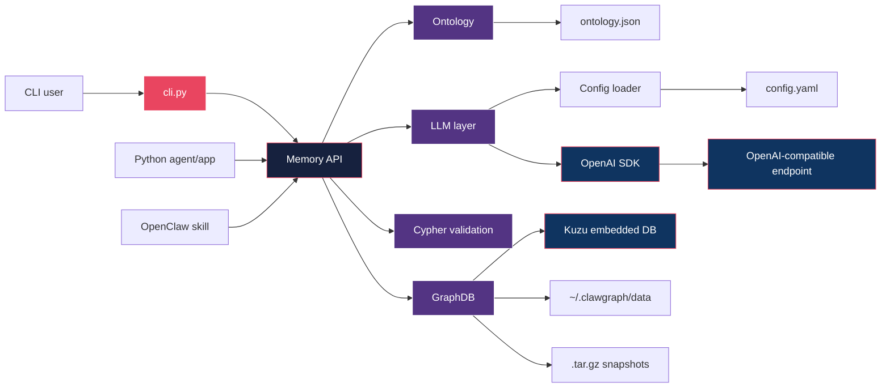
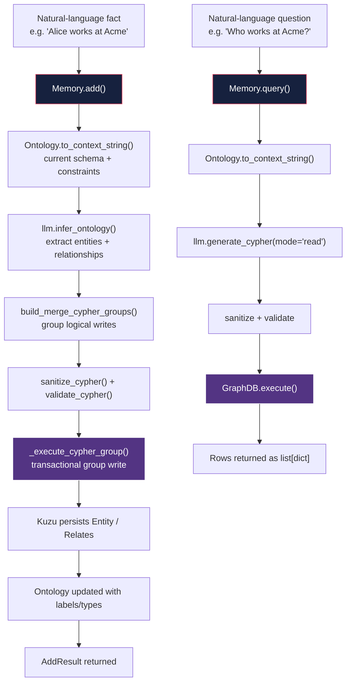
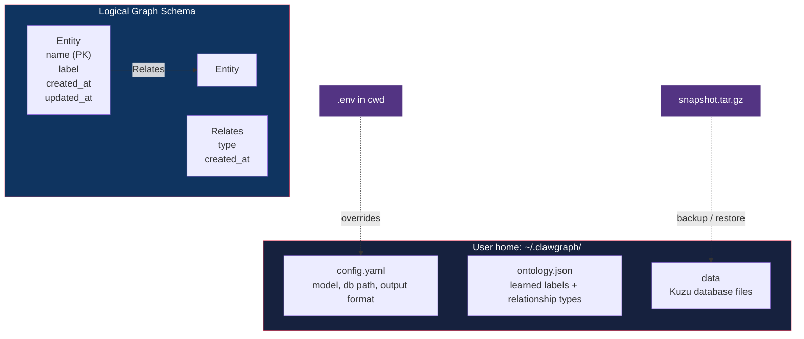
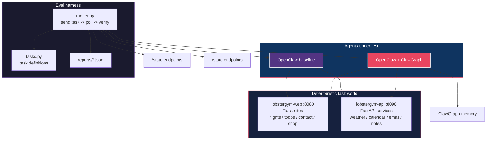
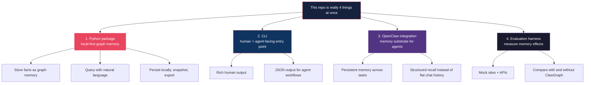

# ClawGraph - Architecture Snapshot

> Last updated: 2026-04-03
> Scope: current repository shape plus the runtime architecture of the published Python package

This note is a current-state map of the repo as it exists today. It is not a roadmap. It is a description of what is actually wired up now.

---

## 1. Repository Map

```mermaid
graph TD
    ROOT["clawgraph repo"]

    ROOT --> SRC["src/clawgraph<br/>published Python package"]
    ROOT --> TESTS["tests<br/>105 collected pytest tests"]
    ROOT --> SKILL["skills/clawgraph/SKILL.md<br/>OpenClaw skill instructions"]
    ROOT --> GYM["lobstergym<br/>evaluation harness + mock services"]
    ROOT --> DOCS["docs<br/>architecture, roadmap, exploration notes"]
    ROOT --> SITE["README.md + site/index.html<br/>project framing + landing page"]
    ROOT --> BUILD["pyproject.toml + GitHub Actions<br/>package, lint, typing, CI"]

    SRC --> CLI["cli.py<br/>Typer CLI"]
    SRC --> MEM["memory.py<br/>high-level memory API"]
    SRC --> LLM["llm.py<br/>OpenAI SDK integration"]
    SRC --> DB["db.py<br/>Kuzu wrapper + snapshots"]
    SRC --> ONT["ontology.py<br/>schema tracking"]
    SRC --> CYPHER["cypher.py<br/>validation + sanitization"]
    SRC --> CFG["config.py<br/>YAML config loader"]
    SRC --> MAIN["__main__.py / __init__.py"]

    GYM --> WEB["web<br/>Flask mock websites"]
    GYM --> API["api<br/>FastAPI mock APIs"]
    GYM --> EVAL["eval<br/>runner + tasks"]
    GYM --> REPORTS["reports<br/>evaluation output"]
    GYM --> COMPOSE["docker-compose.yml<br/>side-by-side profiles"]

    style ROOT fill:#16213e,stroke:#e94560,color:#fff
    style SRC fill:#0f3460,stroke:#e94560,color:#fff
    style GYM fill:#0f3460,stroke:#e94560,color:#fff
    style TESTS fill:#533483,stroke:#fff,color:#fff
    style DOCS fill:#533483,stroke:#fff,color:#fff
    style SKILL fill:#533483,stroke:#fff,color:#fff
    style SITE fill:#533483,stroke:#fff,color:#fff
    style BUILD fill:#533483,stroke:#fff,color:#fff
```

---

## 2. Product Framing

ClawGraph is currently best understood as a local-first graph memory layer for agents.

The repo is doing four jobs at once:

1. A Python package for persistent graph memory
2. A CLI for storing and querying memory without writing code
3. An OpenClaw skill / integration surface
4. A LobsterGym-based evaluation setup for measuring memory effects

The architectural bias is deliberate:

1. Embedded storage over a hosted service
2. Inspectable graph state over opaque memory blobs
3. Small Python-first API over a broad platform surface
4. OpenAI-compatible LLM support today, broader provider support later
5. Kuzu today, additional database backends later

---

## 3. Core Runtime Architecture

### Current boundaries

- `memory.py` is the main orchestration layer
- `db.py` owns Kuzu lifecycle, schema bootstrapping, and snapshot save/load
- `llm.py` owns extraction and Cypher generation via the OpenAI SDK
- `cypher.py` is the safety gate before execution
- `ontology.py` persists the evolving schema used to guide future prompts

---

## 4. What Actually Happens on `add()` and `query()`

### Important current nuance

Most write-oriented CLI behavior now routes through `Memory`, but `cli.py` still has some direct orchestration for read/query formatting. So the package architecture is cleaner than the CLI architecture in a few places.

---

## 5. Persistent State Model

### Current persistence assumptions

1. Kuzu is the only shipping graph backend right now
2. All entities are stored in a generic `Entity` table rather than domain-specific node tables
3. All relationships are stored in a generic `Relates` table with `type` as data
4. Timestamps are part of the core schema and are exercised by tests
5. Snapshots are a first-class portability mechanism

---

## 6. Interfaces That Exist Today

### Python API

The `Memory` API is the primary product surface.

Current high-value methods:

1. `add()`
2. `add_batch()`
3. `query()`
4. `entities()`
5. `relationships()`
6. `export()`
7. `save_snapshot()`
8. `from_snapshot()`

### CLI

Current CLI covers:

1. `add`
2. `add-batch`
3. `query`
4. `export`
5. `ontology`
6. `config`
7. `--output json` flows for agent-facing usage

### OpenClaw skill

The repo still positions ClawGraph as a persistent memory substrate that can plug into OpenClaw-style agent workflows.

---

## 7. LobsterGym Evaluation Topology

The important point is not just that LobsterGym exists. It is that the repo includes an environment intended to measure whether memory improves agent behavior instead of relying only on anecdotal demos.

---

## 8. Current Constraints

The current repo state has a few important architectural constraints:

1. LLM support is OpenAI-compatible today, not truly provider-generic yet
2. Kuzu is the only production backend today
3. The schema is intentionally generic and simple rather than semantically rich
4. Query generation is LLM-driven and validated, but not deterministic in the way a hand-written query API would be
5. Some repo areas mix product code, evaluation work, and strategy docs in the same workspace

These are not necessarily problems. They are just the present shape of the system.

---

## 9. Mental Model

---

## Reading Order

If you want to understand the repo quickly, use this order:

1. [README.md](README.md)
2. [src/clawgraph/memory.py](src/clawgraph/memory.py)
3. [src/clawgraph/llm.py](src/clawgraph/llm.py)
4. [src/clawgraph/db.py](src/clawgraph/db.py)
5. [src/clawgraph/cli.py](src/clawgraph/cli.py)
6. [tests/test_memory.py](tests/test_memory.py)
7. [tests/test_cli.py](tests/test_cli.py)
8. [lobstergym/README.md](lobstergym/README.md)
9. [lobstergym/eval/runner.py](lobstergym/eval/runner.py)

That path gives you: framing -> runtime -> persistence -> interface -> tests -> evaluation.
